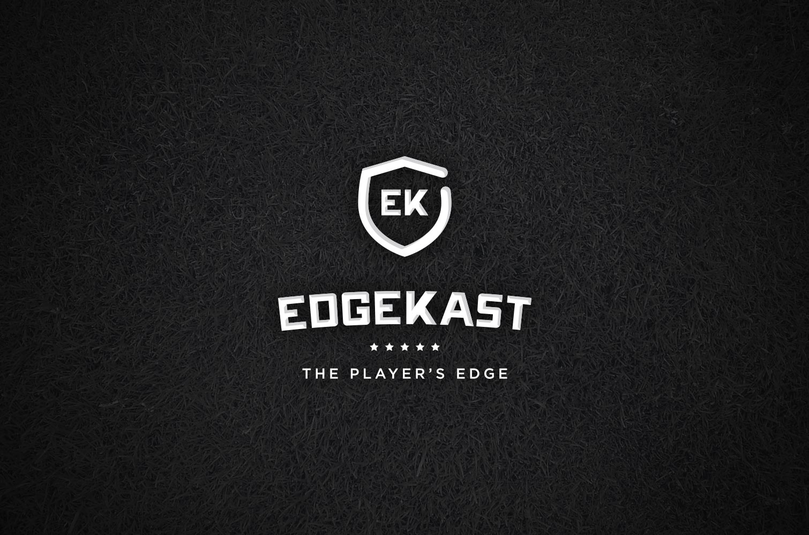
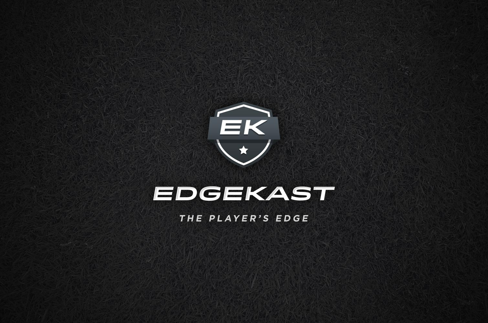
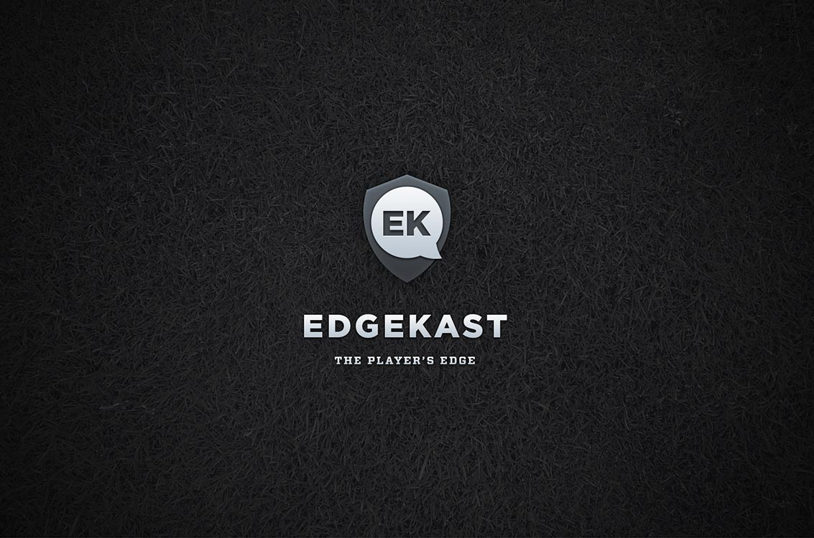
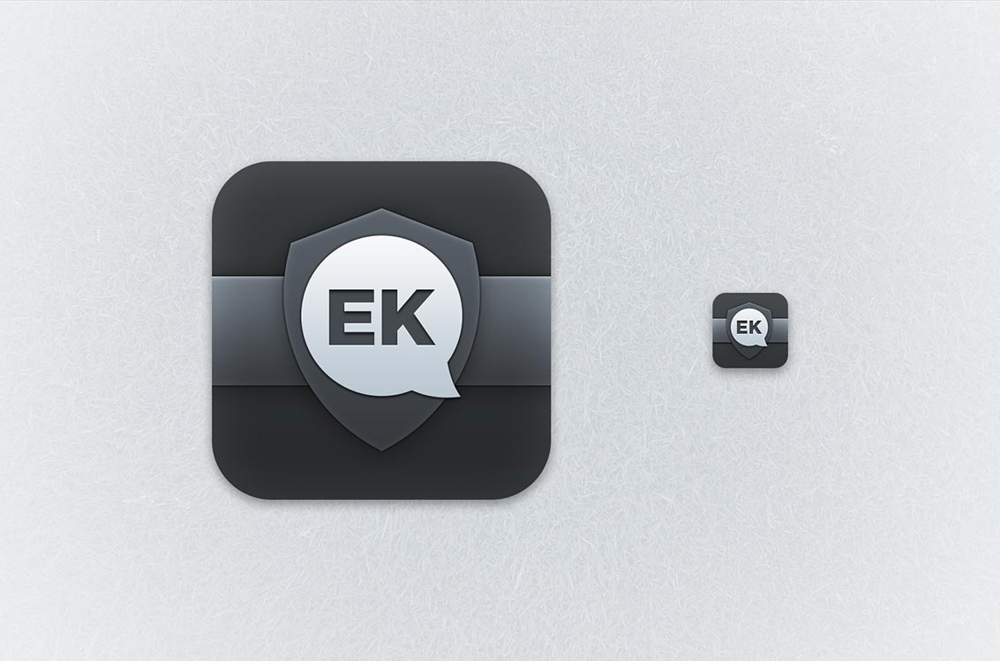
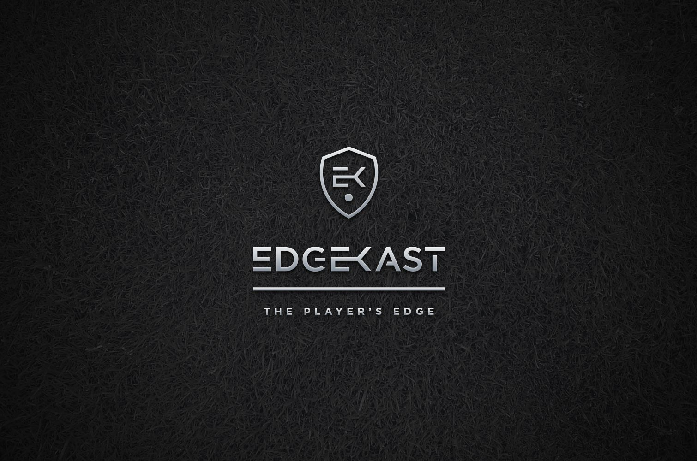
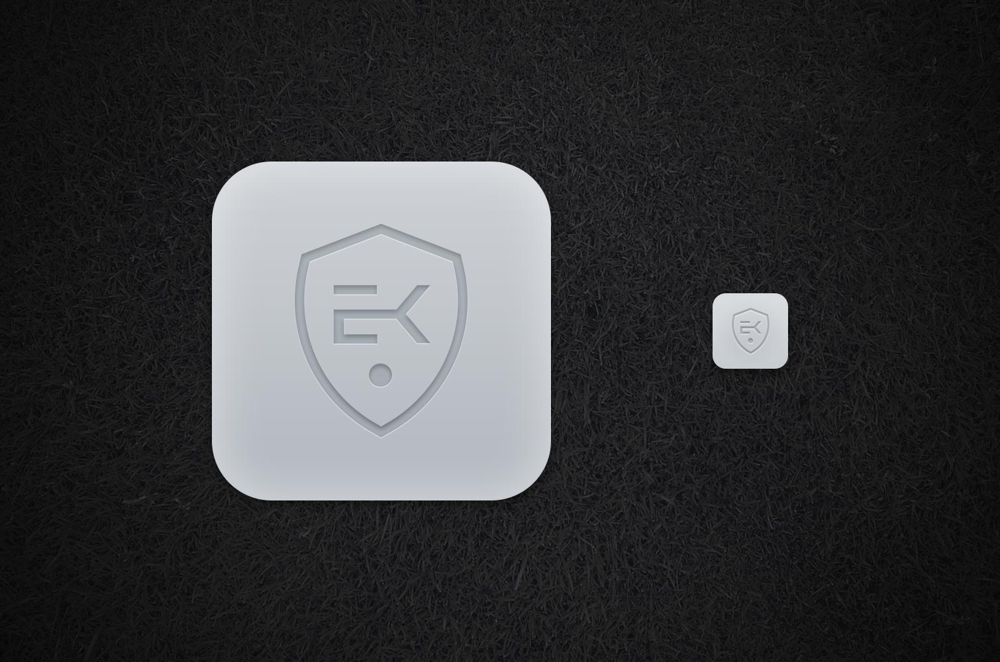

Commissioned branding created for San Francisco startup Edgekast. Edgekast was aiming to be the world's best sports betting iOS app. They ended up changing names and going a different direction, but I still enjoyed creating this mark and few icons.

The project began like many others: I sketched several ideas (not shown here) and zero-ed in on a few ideas, created the digital concepts you see below and finally settled on a mark and icon.

## Concepts

## Final Mark & Icon

