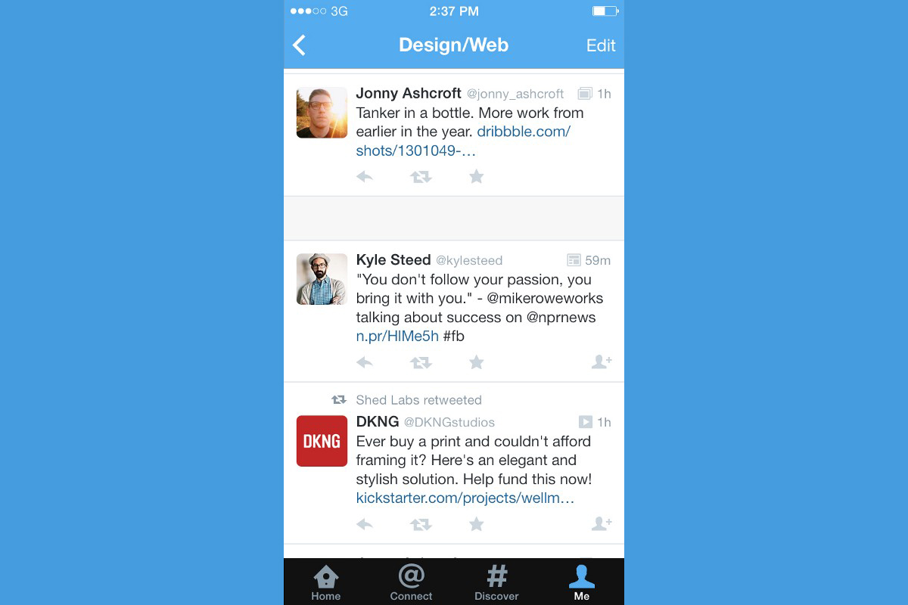

We breath in and out with a timed rhythm. Our hearts beat at a perfect pulse. Some people even sleep and wake up on certain schedules. As we look into this sense of rhythm and pulse, we notice that this pattern is repeated in much of nature. Have we learned to apply this same pattern to our designs to make our work feel even more natural?

## Naturally human
If we look deep enough into the way we have been wired as humans, we see that this pattern of activity and rest are very natural. We breathe in and out. Our hearts flex and rest. We wake and sleep. The examples of such patterns are virtually endless. It’s these patterns, along with several other factors, that make us distinctively human and allow us to accomplish so many things.

## Unnaturally machine
Computers and machines, on the other hand, are quite different. Computers can perform a specific set of tasks for hours and hours on end without any lapse of judgement or tiring. This creates an obvious and severe contrast with us as humans. If we are not aware of this, we sometimes feel the need to become more machine-like in our actions. In a greater sense, we work non-stop eight to nine hours a day (and sometimes more) which leads us to develop this sense of machine-like work that we must accomplish, unless we want to feel unproductive. Ultimately, this sense of non-stop work could lead to stress, depression and possibly even health problems.

## The problem
Many applications fall into the “unnaturally machine” category by spitting out screen after screen of heavy cognitive actions. This adds to the problem of making us feel like we need to complete these actions as quickly as possible without any break or rest. It’s as if computers and machines are dictating the way we’re supposed to function naturally as humans.

## A solution
What if we decided to take the control back from computers and machines? Suppose we make these objects become more human-like by creating a larger sense of pulse and rhythm. What would it look like? Well, it could look something like this:

### The list/feed
With Twitter, users are fed a non-stop list of items to read. Tweet after tweet contains words, links and pictures to consume, and many people feel the stressful need to consume it all. This problem could easily be fixed by creating a small “white space” between every certain number of tweets. This not only gives the viewer easy-to-read chunks of tweets, but it also provides a respite before continuing down the list of tweets.

*Example of “white space” between tweets.*

* *It’s important to note that this doesn’t create any hiccups in usability by keeping content out of reach for the user. If a user is intentional about it, they can simply skip over each space and continue down the list.*

***Also note that this could easily be confusing when tweets are truncated by the Twitter app, but this is just a theory and would require much more thought before actual implementation.*

## The large form
Large forms are usually a big no-no for usability, but sometimes they are necessary. For example, applying for an apartment online would require several form fields with many marked as “required.” If the designer of the form simply put a few visual breaks between several chunks of form fields, it could create the pulse and rhythm pattern directly within the form. A possible example of a “form break”:

{input element}  
Excellent! You’re about halfway done! We’ve saved your work up until this point, so feel free to take a break. We will be right here when you get back.  
{input element}

*Again, the user can decide to simply continue on with the form, but if the user wasn’t purposely trying to quickly fill out the form, this might be a welcome sight.

## In closing…
Again, this concept is just a thought. Each idea would need to be thought through in more depth before actually incorporating into designs.

Is this something worth considering? What would you change to make our experiences with technology even more human-like?
